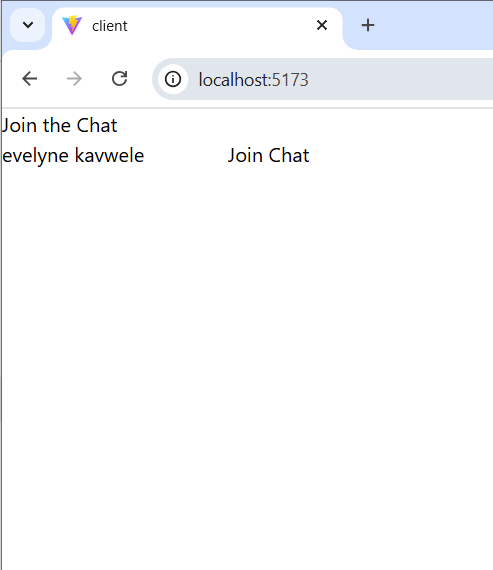
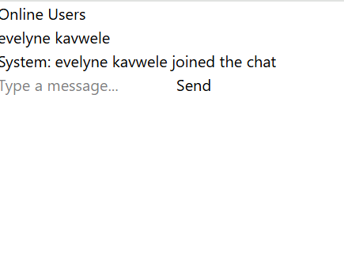
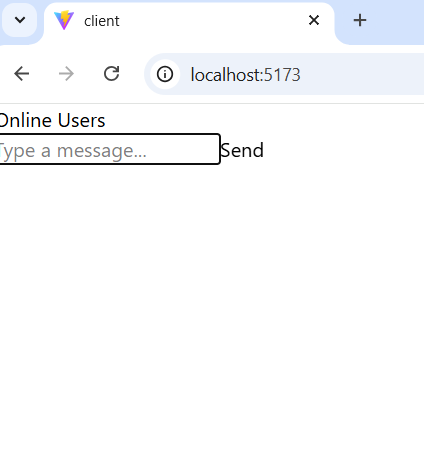
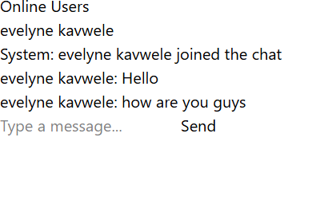
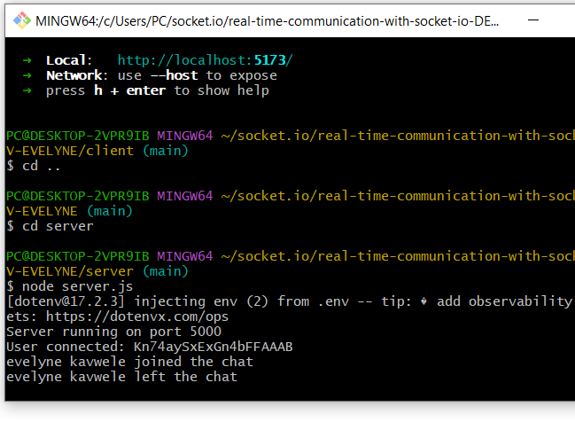

# Real-Time Chat Application

A **real-time chat application** built with **React**, **Socket.IO**, and **Node.js**. Users can send and receive messages instantly, see who is online, and enjoy a responsive, user-friendly interface.

---

## 📝 Project Overview

This project demonstrates a basic **real-time chat system** using Socket.IO for instant communication between clients and a Node.js server. The frontend is built with React and styled using Tailwind CSS. The application supports:

- Dynamic message sending and receiving in real-time
- Active user list updates
- Responsive design for various screen sizes
- Easy-to-extend architecture for future features like chat rooms or private messaging

---

## ⚡ Features Implemented

- **Real-Time Messaging:** Messages are instantly broadcasted to all connected users.
- **Dynamic User List:** See a live list of connected users.
- **Responsive UI:** Styled with Tailwind CSS for a clean, modern look.
- **Socket Context:** React context for global socket access.
- **Custom Hooks:** Manage chat state efficiently with React hooks.

---

## 🛠️ Setup Instructions

### Backend (Server)

1. Navigate to the server folder:

```bash
cd server
Install dependencies:

bash
npm install
Start the backend server:

bash
node sever.js
The server will run on http://localhost:5000.

Frontend (Client)
Navigate to the client folder:

bash
cd client
Install dependencies:

bash
Copy code
npm install
Start the frontend:

bash
npm run dev
The client will run on http://localhost:5173

🚀 Usage
Open the frontend in browser (http://localhost:5173).

Enter a username to join the chat.

Start sending messages to other users.

📸 Screenshots







📁 Project Structure
real-time-communication-with-socket-io-DEV-EVELYNE/
│
├─ client/                             # React frontend
│  ├─ node_modules/                    # Installed dependencies
│  ├─ public/                          # Public assets
│  │  └─ vite.svg                       # Default Vite logo
│  ├─ src/                              # Source code
│  │  ├─ assets/                        # Images, icons, and static assets
│  │  ├─ components/                    # React UI components
│  │  │  ├─ MessageInput.jsx             # Component for typing messages
│  │  │  ├─ MessageList.jsx              # Component for displaying messages
│  │  │  └─ UserList.jsx                 # Component for showing online users
│  │  ├─ context/                        # React context for global state
│  │  │  └─ SocketContext.jsx            # Provides socket connection to the app
│  │  ├─ hooks/                          # Custom React hooks
│  │  │  └─ useChat.jsx                  # Hook for chat state management
│  │  ├─ pages/                          # React pages
│  │  │  └─ ChatPage.jsx                 # Main chat page
│  │  ├─ socket/                         # Socket client setup
│  │  │  └─ socket.js                     # Initializes socket connection
│  │  ├─ App.jsx                          # Root React component
│  │  ├─ App.css                          # App styling
│  │  ├─ index.css                        # Global styles
│  │  └─ main.jsx                         # React entry point
│  ├─ .env                               # Environment variables
│  ├─ package.json                        # Frontend dependencies and scripts
│  ├─ vite.config.js                       # Vite configuration
│  └─ tailwind.config.js                   # Tailwind CSS configuration
│
├─ server/                             # Node.js backend
│  ├─ config/                           # Configuration files
│  │  └─ config.js                        # Server configuration (ports, DB, etc.)
│  ├─ controllers/                       # API controllers
│  │  ├─ chatController.js                # Chat-related logic
│  │  ├─ notificationController.js       # Notifications handling
│  │  └─ userController.js               # User management logic
│  ├─ models/                            # Database models (if any)
│  ├─ socket/                            # Socket.io logic
│  │  └─ socketHandler.js                # Handles socket events
│  ├─ utils/                             # Utility functions
│  │  ├─ formatMessage.js                # Formats chat messages
│  │  └─ logger.js                        # Logging helper
│  ├─ .env                               # Environment variables
│  ├─ package.json                        # Backend dependencies and scripts
│  └─ index.js                             # Server entry point
│
├─ screenshots/                          # Screenshots or GIFs of the app
│
├─ README.md                              # Project documentation
└─ Week5-Assignment.md                     # Assignment n

🔗 Socket.IO Events
Frontend
connect → Establishes connection with server

disconnect → Handles user disconnection

sendMessage → Sends a new message

receiveMessage → Receives messages from the server

updateUsers → Updates the active user list

Backend
connection → Triggered on a new socket connection

disconnect → Triggered when a user disconnects

sendMessage → Broadcasts messages to all users

updateUsers → Sends updated user list

📜 License
License © 2025

👤 Author
Evelyne Kavwele


